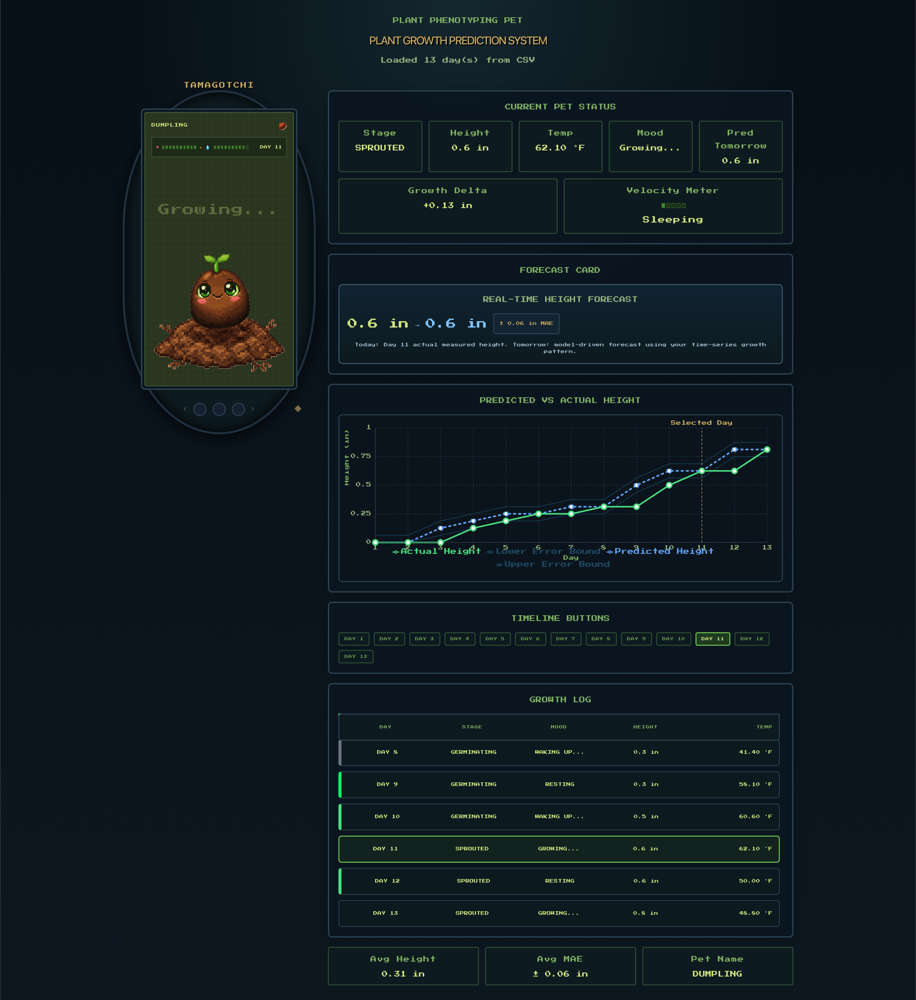
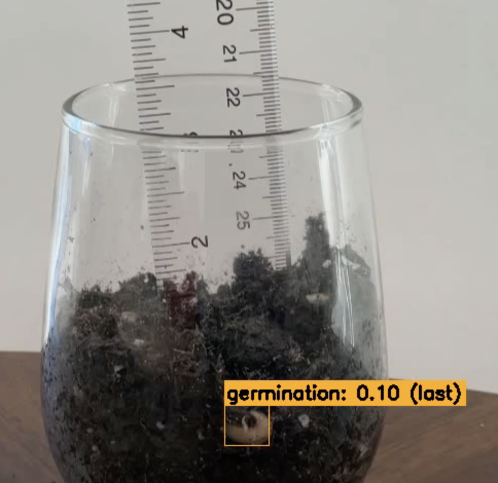

# Timelapse Plant Phenotyping — Growth Stage Detection & Dashboard

An end-to-end computer vision and data pipeline for automated plant growth stage detection, height prediction, and real-time visualization — built on original self-collected timelapse data.

---

## Demo

**Tamagotchi Seed Dashboard** — React frontend visualizing 12 days of plant growth data with pixel-art UI, day-by-day growth log, temperature tracking, and mood system:




**Germination Detection** — Faster R-CNN bounding box detection on original timelapse frame:



---

## Overview

Monitoring plant growth manually is time-consuming and subjective. This project automates the detection and tracking of early plant growth stages from timelapse imagery using a custom-trained object detection model, a regression-based height prediction module, and a React dashboard for visualization.

**The full pipeline:**
1. Capture timelapse video daily → extract frames
2. Annotate frames with YOLO-format labels across 3 growth stage classes
3. Train Faster R-CNN on custom dataset
4. Run inference → generate detection outputs and predictions CSV
5. Feed predictions into React dashboard for day-by-day visualization

---

## What I Built

| Component | Details |
|---|---|
| Data Collection | Original timelapse video captured daily across 12-day plant lifecycle |
| Frame Extraction | `extract_frames.py` — automated frame extraction from raw mp4 videos |
| Annotation | Manual YOLO-format labeling across 3 growth stage classes |
| Object Detection | Faster R-CNN (PyTorch / torchvision), trained from scratch on custom dataset |
| Height Prediction | Regression model (`height_prediction/`) trained on `height_dataset.csv` → outputs `sprout_forecast.csv` |
| Frontend | React dashboard with pixel-art Tamagotchi UI, timeline navigation, growth log, temperature and mood tracking |

---

## Growth Stages Detected

| Class | Stage | Description |
|---|---|---|
| 0 | Seed | Initial planted state, no visible emergence |
| 1 | Germination | First signs of root or shoot emergence |
| 2 | Early Sprouting | Visible above-soil growth |

---

## Repository Structure

```
timelapse-plant-phenotyping/
├── data/
│   ├── detection/
│   │   ├── images/{train,val}/<day_x>/   # Timelapse frames
│   │   ├── labels/{train,val}/           # YOLO-format annotations
│   │   └── data.yaml                     # Dataset config
│   ├── frames/                            # Extracted frames
│   ├── predictions/
│   │   └── height_dataset.csv            # Height measurements per day
│   └── raw_videos/                        # Original mp4 timelapse recordings
├── src/
│   ├── data/
│   │   └── extract_frames.py             # Frame extraction from video
│   ├── object_detection/
│   │   ├── detection_dataset.py          # Dataset class (YOLO → bounding boxes)
│   │   ├── train_seed_detector.py        # Faster R-CNN training script
│   │   ├── detect_image.py               # Single image inference
│   │   ├── detect_video.py               # Video inference
│   │   └── split_frames.py               # Train/val frame splitting
│   └── height_prediction/                # Regression model for height forecasting
├── frontend/                              # React + pixel-art Tamagotchi dashboard
├── models/                                # Saved model checkpoints
└── output/
    ├── detection_images/                  # Inference output images
    ├── detection_videos/                  # Inference output videos
    └── predictions/
        └── sprout_forecast.csv            # Height prediction outputs
```

---

## Quick Start

**Install Python dependencies:**
```bash
python3 -m venv .venv
source .venv/bin/activate
pip install torch torchvision
```

**Extract frames from timelapse video:**
```bash
python3 src/data/extract_frames.py
```

**Train the detection model:**
```bash
python3 src/object_detection/train_seed_detector.py
```

**Run inference on an image:**
```bash
python3 src/object_detection/detect_image.py --image path/to/frame.jpg
```

**Run the React dashboard:**
```bash
cd frontend
npm install
npm start
```

---

## Key Design Decisions

**Why Faster R-CNN?** Two-stage detectors perform better on small, low-contrast objects like seeds and early sprouts compared to single-stage alternatives. Precision matters more than inference speed for a daily timelapse pipeline.

**Why train from scratch?** No pretrained model exists for this domain. Custom annotation was required to capture what constitutes each growth stage under real timelapse lighting conditions.

**Why a Tamagotchi-style dashboard?** Growth data is most meaningful as a time-series narrative — the pixel-art UI frames plant growth as a living system with mood, hydration, and status rather than just raw numbers. It also makes the project memorable.

**Why a separate height prediction module?** Detection tells you *what stage* the plant is in. Regression on the `height_dataset.csv` adds a quantitative dimension — predicting next-day height from current measurements — making the system more actionable.

---

## Stack

`Python` · `PyTorch` · `torchvision` · `Faster R-CNN` · `React` · `recharts` · `YOLO annotation format` · `CSV`

---

## Dataset

Data collected from a single plant timelapse across a 12-day early lifecycle window (seed through early sprouting). The dataset focuses on the earliest and most difficult-to-distinguish stages of plant growth, where automated detection has the highest practical value for agriculture and research applications.

---

## Future Work

- Add pretrained ResNet backbone to improve convergence speed
- Expand dataset across multiple plant species and lighting conditions
- Deploy detection model as a FastAPI endpoint for real-time inference
- Integrate live camera feed support into the dashboard
